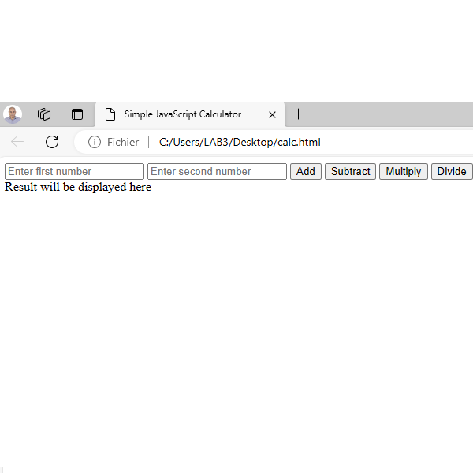

# Simple JavaScript Calculator

This is a simple JavaScript calculator that allows you to perform basic arithmetic operations such as addition, subtraction, multiplication, and division. You can enter two numbers, click on the corresponding operation button, and see the result displayed on the screen.

## How to Use

1. Enter the first number in the "Enter first number" field.
2. Enter the second number in the "Enter second number" field.
3. Click on one of the operation buttons: "Add," "Subtract," "Multiply," or "Divide."
4. The result of the operation will be displayed in the "Result" section.

## Features

- Addition: Add two numbers together.
- Subtraction: Subtract the second number from the first.
- Multiplication: Multiply the two numbers.
- Division: Divide the first number by the second. Division by zero is not allowed.

## License

This project is licensed under the [MIT License](LICENSE.md).

---

**Author**: Larbi OUIYZME

**Version**: 1.0
